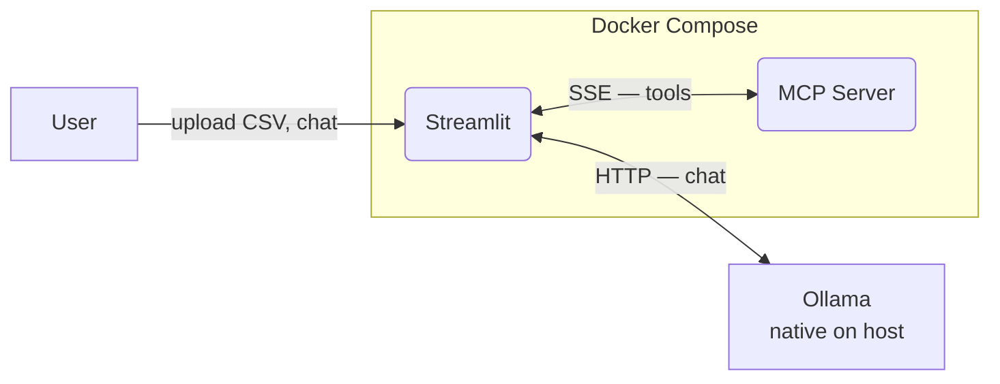

# DataPilot

A locally-running AI data analysis tool. Users upload a CSV file via a Streamlit UI and ask an LLM (Ollama) questions about the data. Built using the Model Context Protocol (MCP) to connect the LLM to data tools.

## Project Goals

- Learn MCP server architecture
- Build a working local LLM pipeline
- Portfolio project — prioritise understanding over speed

## Tech Stack

- **Python** — primary language
- **UV** — package and project management
- **Ollama** — local LLM server (tool-use capable model e.g. llama3.1)
- **MCP** — protocol connecting Ollama to data tools
- **Streamlit** — user interface
- **pandas** — CSV parsing and data manipulation
- **Taskipy** — task shortcuts via `pyproject.toml`
- **Docker + Docker Compose** — containerisation and service orchestration
- **Pytest** — testing
- **GitHub Actions** — CI

## Project Structure

```
datapilot/
├── docker-compose.yml
├── pyproject.toml              # UV project + Taskipy tasks
├── CLAUDE.md
├── .github/
│   └── workflows/
│       └── ci.yml
├── mcp_server/                 # MCP server service
│   ├── Dockerfile
│   └── src/
│       ├── server.py
│       └── tools/
│           └── csv_tools.py    # load_csv, query_data tools
├── streamlit_app/              # UI service
│   ├── Dockerfile
│   └── src/
│       └── app.py
├── tests/
│   └── test_csv_tools.py
└── data/
    └── sample_sales.csv        # sample data for development
```

## Prerequisites

> **Note:** Ollama should be installed natively on your machine rather than through Docker, especially on Apple Silicon (M1/M2/M3) Macs where native performance is significantly better.
> Full setup instructions to be added once the project is running end-to-end.
> "We kept Ollama native on macOS because Docker's Linux VM layer prevents it from accessing Apple Silicon's GPU, which would make inference unacceptably slow."

## Service Architecture

Two services run in Docker Compose; Ollama runs natively on the host.

| Service      | Runs in Docker | URL                           |
|--------------|----------------|-------------------------------|
| MCP Server   | Yes            | `http://localhost:8000/sse`   |
| Streamlit    | Yes            | `http://localhost:8501`       |
| Ollama       | No (native)    | `http://localhost:11434`      |

Ollama runs natively rather than in Docker because Docker's Linux VM layer prevents it from accessing Apple Silicon's GPU, which makes inference unacceptably slow on M1/M2/M3 Macs.

The MCP server uses SSE (Server-Sent Events) transport. Streamlit reaches it at `http://mcp_server:8000/sse` inside the Docker network, and reaches Ollama at `http://host.docker.internal:11434`.

