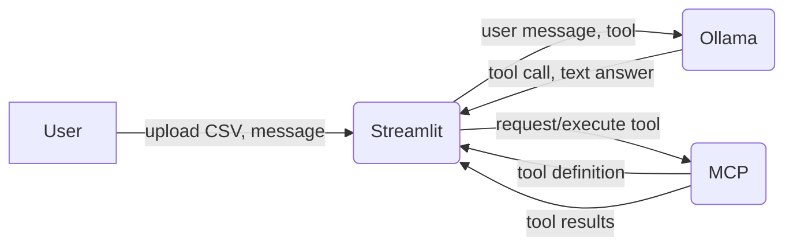

# DataPilot

A locally-running AI data analysis tool. Users upload a CSV file via a Streamlit UI and ask an LLM (Ollama) questions about the data. Built using the Model Context Protocol (MCP) to connect the LLM to data tools.

## Project Goals

- Learn MCP server architecture
- Build a working local LLM pipeline
- Portfolio project — prioritise understanding over speed

## Tech Stack

- **Python** — primary language
- **UV** — package and project management
- **Ollama** — local LLM server (tool-use capable model e.g. llama3.1)
- **MCP** — protocol connecting Ollama to data tools
- **Streamlit** — user interface
- **pandas** — CSV parsing and data manipulation
- **Plotly** — chart generation
- **Taskipy** — task shortcuts via `pyproject.toml`
- **Docker + Docker Compose** — containerisation and service orchestration
- **Pytest** — testing
- **GitHub Actions** — CI

## Project Structure

```
datapilot/
├── docker-compose.yml
├── pyproject.toml              # UV project + Taskipy tasks
├── CLAUDE.md
├── .github/
│   └── workflows/
│       └── ci.yml
├── mcp_server/                 # MCP server service
│   ├── Dockerfile
│   └── src/
│       ├── server.py
│       └── tools/
│           ├── csv_tools.py    # load_csv, query_data tools
│           └── chart_tools.py  # make_chart tool (later phase)
├── streamlit_app/              # UI service
│   ├── Dockerfile
│   └── src/
│       └── app.py
├── tests/
│   ├── test_csv_tools.py
│   └── test_chart_tools.py
└── data/
    └── sample_sales.csv        # sample data for development
```

## Prerequisites

> **Note:** Ollama should be installed natively on your machine rather than through Docker, especially on Apple Silicon (M1/M2/M3) Macs where native performance is significantly better.
> Full setup instructions to be added once the project is running end-to-end.
> "We kept Ollama native on macOS because Docker's Linux VM layer prevents it from accessing Apple Silicon's GPU, which would make inference unacceptably slow."

## Service Architecture

Three Docker services defined in `docker-compose.yml`:

- `ollama` — LLM server, official image, models persisted via named volume
- `mcp_server` — Python MCP server exposing CSV and chart tools
- `streamlit` — Streamlit UI, communicates with mcp_server and ollama

Services communicate by service name on the Docker network (e.g. `http://ollama:11434`).

| Service      | Internal URL                      | External (host) URL           |
|--------------|-----------------------------------|-------------------------------|
| Ollama       | `http://ollama:11434`             | `http://localhost:11434`      |
| MCP Server   | `http://mcp_server:8000/sse`      | `http://localhost:8000/sse`   |
| Streamlit    | `http://streamlit:8501`           | `http://localhost:8501`       |

The MCP server uses SSE (Server-Sent Events) transport — Streamlit connects to it at `http://mcp_server:8000/sse`.

